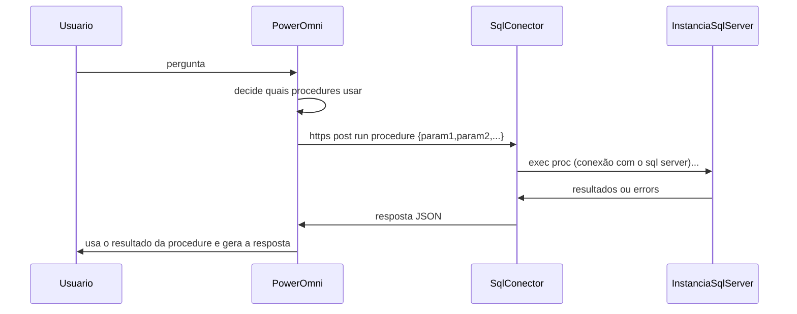

# Conector de SQL Server do Power Omni

Este diretório contém exemplos de código para você conseguir integrar o Power Omni com o seu SQL Server.  
Este conector é um serviço HTTP que precisa ser acessível pelo Power Omni e conseguir chegar na instância SQL Server desejada.  

Ele funciona expondo as procedures com possuem o prefixo `spOmni` como endpoints HTTP, permitindo que elas sejam executadas pelo Power Omni através de métodos POST.  


O fluxo típico é o seguinte:



Ou seja, este conector fica entre o Power Omni e a sua instância SQL Server.  
Ele deve estar acessível através do protocolo https, com certificado válido e protegido por autenticação de API KEY.  
E, além disso, precisa conseguir chegar no seu SQL Server.  

# Instalando o Conector 

A maneira mais fácil de começar a usar é você subir um App Service no seu Azure.  
Clique no botão abaixo e uma tela no azure vai ser aberta para que você possa criar o app service.  
Você deve ser cliente da Power Omni. Você vai precisa de um token de instalação, peça no seu canal de comunicação.  

Pré-Requisitos:

- Crie um banco de dados (exemplo AiTools) e um login e senha (por enquanto, funciona apenas com SQL Authentication) com as permissões necessários:  
```sql 
CREATE DATABASE PowerOmni;
CREATE LOGIN PowerOmni WITH PASSWORD = 'TroquePorUmaSenhaForte';
GO 
USE PowerOmni;
CREATE USER PowerOmni;
GRANT EXECUTE,VIEW DEFINITION TO PowerOmni;
```
- Você vai precisar fornecer uma string de conexão pro seu SQL server.  
Tenha em mãos o endereço e porta pelo qual o seu SQL server vai responder, e substitua nas string de conexão abaixo:
`Server=endereco,porta;Database=PowerOmni;User Id=PowerOmni;Password=TroquePorUmaSenhaForte`  
Você vai fornecer essa string quando for fazer o deploy do template. 

- Você vai precisar de um token de instalação. Basta solicitar ao time do Power Tuning no canal de suporte que preferir.

[](https://portal.azure.com/#create/Microsoft.Template/uri/https%3A%2F%2Fraw.githubusercontent.com%2Fsoupowertuning%2Fpower-omni%2Frefs%2Fheads%2Fmain%2Fintegracoes%2Fmssql%2Fazdeploy.json)


# Formato da procedure 

As procedures criadas no banco que o omni acessa precisam ter um formato específico.  
Consulte os [exemplos de procedures](exemplos/procedures) para mais detalhes.  


